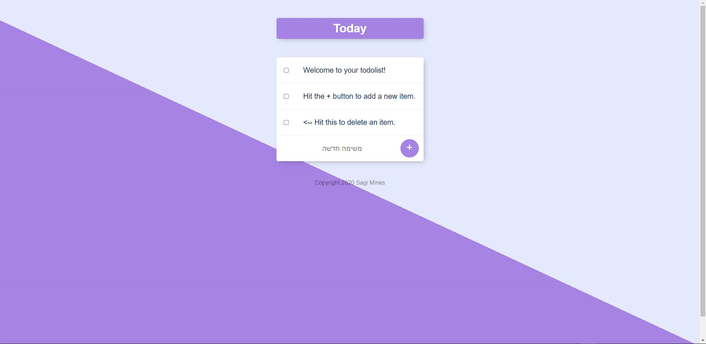

# 📝To-Do-List

[Link to the web app](https://sheltered-sea-71015.herokuapp.com/ 'To-Do-List App')  
A simple To-do-list app that makes it eazy to orginize your tasks and delete the tasks that you have completed.

# Technologies

**Frontend** - HTML, CSS, EJS.  
**Backend** - Node.js.  
**Database used** - MongoDB Atlas(Mongoose).

# Interface

  
This is the start up screen that the client will see.
the client can simply add a task and when he finishes the task he can simply delete it by checking the box beside the task.
The database is backedup on the cload (Atlas) so the information will not be deleted. Unless, the client decide he wants to delete the data.
